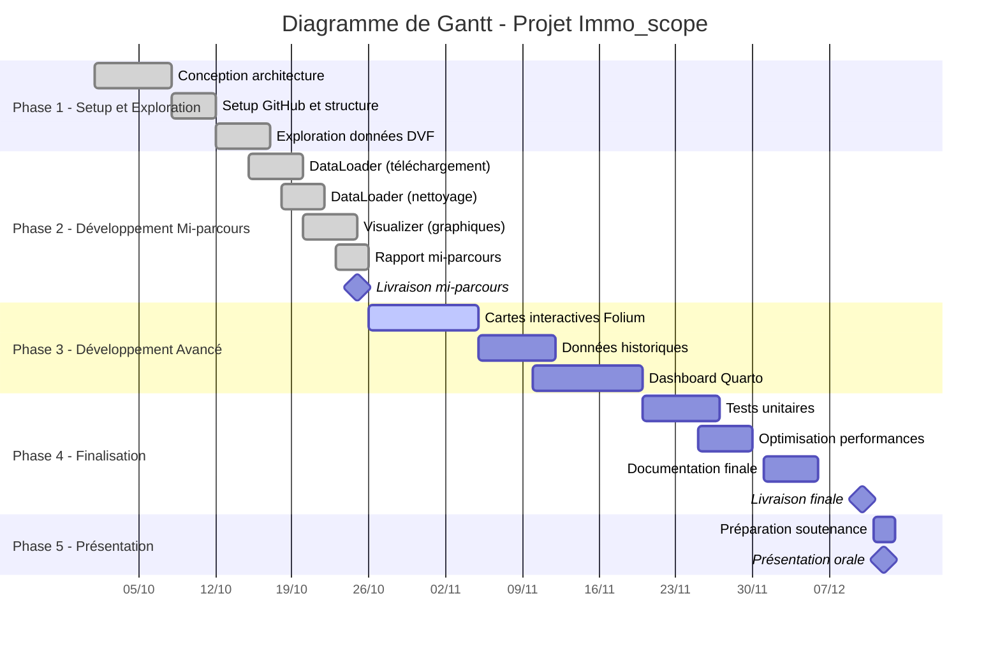

# Immo_scope - Rapport de Mi-parcours

## 📋 Informations du Groupe
- **Nom du projet**: Immo_scope
- **Membres**: 
  - Rodrigue Mamy (22510795)
  - Benaissa Hadjer (22506347)
  - Léa Benameur (22514472)
- **Date**: 25 octobre 2025

## 🎯 Description du Projet
**Immo_scope** est un dashboard interactif pour visualiser l'évolution des prix immobiliers en France à partir des données DVF (Demandes de Valeurs Foncières).

### Objectifs
- Visualiser les prix au m² par département
- Analyser l'évolution temporelle des prix
- Comparer les dynamiques urbaines vs rurales
- Créer des cartes interactives des prix

## 🏗️ Architecture du Projet

### Structure des fichiers
```
Immo_scope/
├── immo_scope/              # Module Python principal
│   ├── data_loader.py      # Téléchargement et nettoyage des données
│   └── visualizer.py       # Création des visualisations
├── data/
│   ├── raw/               # Données brutes DVF
│   └── processed/         # Données nettoyées
├── notebooks/             # Exploration des données
└── roadmap/              # Rapport mi-parcours
```

### Technologies utilisées
- **Python 3.12** avec pandas, plotly, requests
- **Plotly** pour les visualisations interactives
- **Git/GitHub** pour le versioning
- **Quarto** pour le rapport final

## 📊 Résultats Préliminaires

### Données analysées
- **100 transactions immobilières** traitées
- **Prix moyen**: 4 617 €/m²
- **Surface moyenne**: 88 m²
- **Budget moyen**: 273 073 €

### Visualisations créées
1. **Distribution des prix** au m²
2. **Classement des départements** par prix
3. **Relation prix vs surface**
4. **Top communes** par transactions

## 🔄 Organisation Git

### Branches créées
- `main` - Version stable
- `dev` - Développement
- `feat/data-pipeline` - Traitement des données
- `feat/visualizations` - Création des graphiques

### Prochaines étapes
- [ ] Intégration des données historiques
- [ ] Création de cartes interactives avec Folium
- [ ] Déploiement du dashboard Quarto
- [ ] Tests unitaires et CI/CD

## 🔗 Liens
- **Repository GitHub**: https://github.com/mamyrodriguez7-gif/Immo_scope
- **Données DVF**: https://www.data.gouv.fr/fr/datasets/demandes-de-valeurs-foncieres/

## 🎨 Maquettes des Résultats

### Carte interactive souhaitée
Une carte de France avec des points colorés selon le prix au m² :
- 🔴 Zones > 8 000 €/m² (Paris, centres villes)
- 🟠 Zones 5 000 - 8 000 €/m² (Villes principales)
- 🟡 Zones 3 000 - 5 000 €/m² (Banlieues)
- 🟢 Zones < 3 000 €/m² (Zones rurales)

### Dashboard final
Layout avec 6 composants principaux :
1. **Carte France** interactive
2. **Histogramme** distribution des prix
3. **Courbe** évolution temporelle
4. **Classement** départements
5. **Carte de chaleur** densité transactions
6. **Panneau de filtres** (année, type, surface)

## 📅 Planning Détaillé (Diagramme de Gantt)

### Échéances Clés
- **25 octobre 2025** ✅ Livraison mi-parcours
- **10 décembre 2025** Livraison finale
- **12 décembre 2025** Présentation orale

### Diagramme de Gantt

